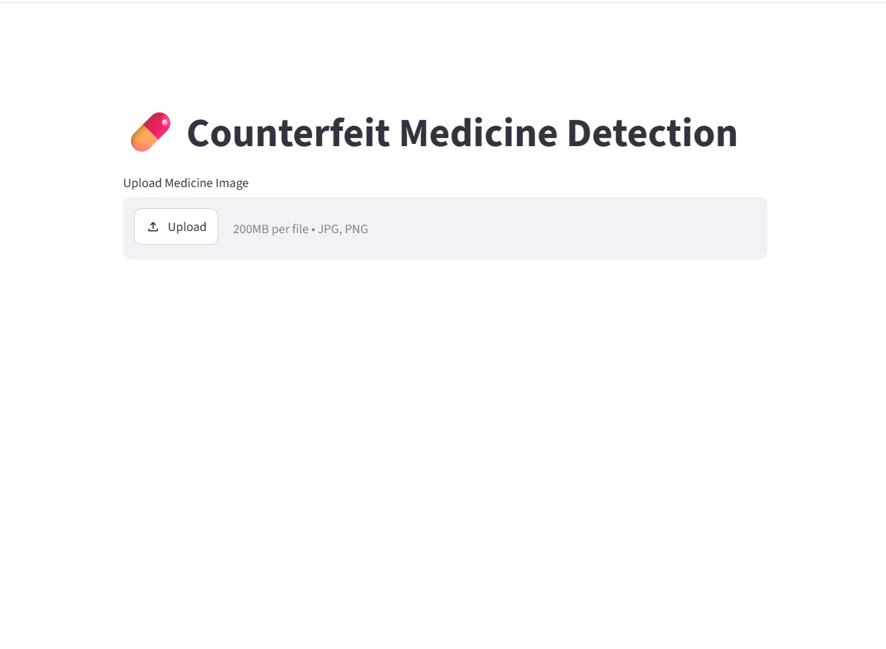
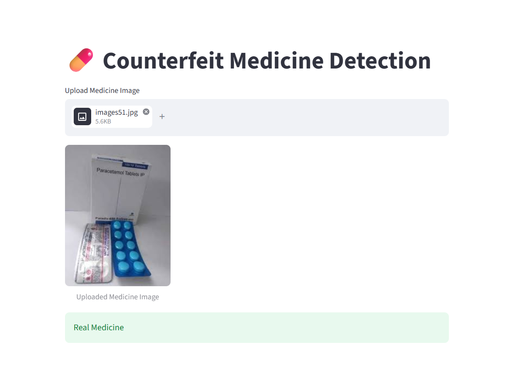
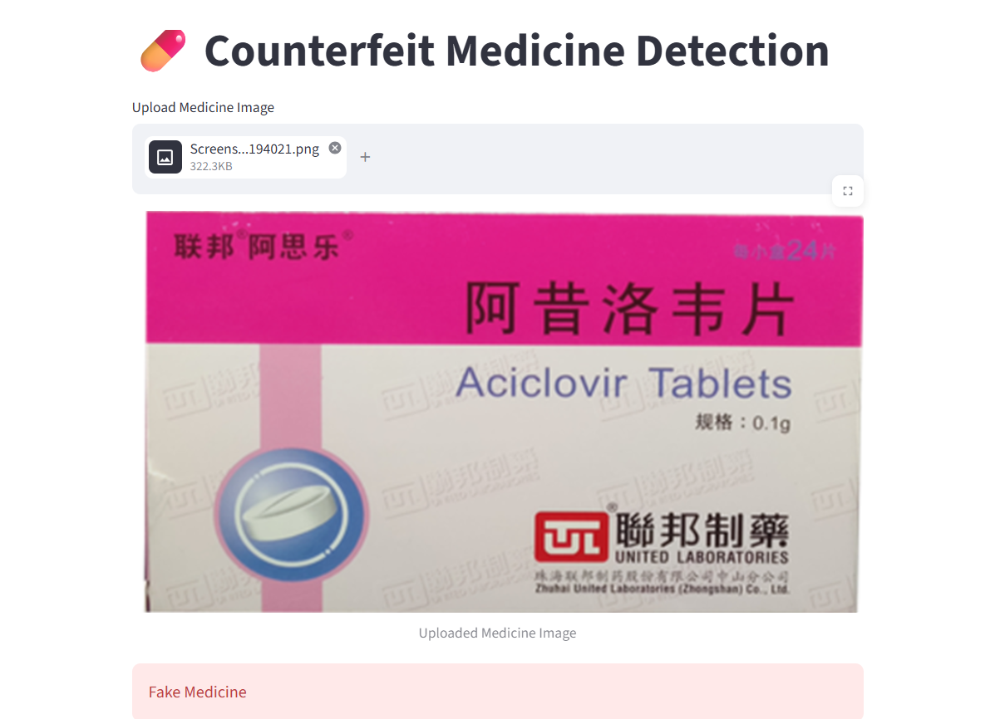

# 💊 Counterfeit Medicine Detection System Using Deep Learning

A deep learning-based image classification system that identifies medicine packaging as **Real** or **Fake** using **Convolutional Neural Networks (CNN)** and **TensorFlow/Keras**.

The trained deep learning model is integrated with a **Streamlit web application**, allowing users to upload a medicine image and receive a prediction.

---

## 📌 Project Overview

Counterfeit medicines can create serious risks for consumers and healthcare systems.

This project demonstrates how **Deep Learning and Computer Vision** can be used to classify medicine images into two categories:

- ✅ Real Medicine
- ❌ Fake Medicine

The system takes a medicine image as input, preprocesses the image, and passes it through a trained CNN model to generate the classification result.

---

## 🎯 Objectives

- Build an image classification model using CNN.
- Classify medicine images as real or fake.
- Apply image preprocessing before prediction.
- Integrate the trained model into a web application.
- Provide an easy-to-use interface for image-based predictions.

---

## 🚀 Features

- 📷 Upload medicine images
- 🖼️ Image preprocessing
- 🧠 CNN-based image classification
- 💊 Real vs Fake medicine prediction
- 🌐 Streamlit web application
- ⚡ Real-time prediction
- 🐍 Python-based implementation

---

## 🛠️ Technologies Used

### Programming Language
- Python

### Deep Learning
- TensorFlow
- Keras
- Convolutional Neural Networks (CNN)

### Data Processing
- NumPy
- Image preprocessing

### Computer Vision
- OpenCV

### Web Application
- Streamlit

### Development Tools
- Jupyter Notebook
- Visual Studio Code
- Git
- GitHub

---

## 🔄 Project Workflow

```text
Medicine Image
      ↓
Image Upload
      ↓
Image Preprocessing
      ↓
Resize to 224 × 224
      ↓
Pixel Normalization
      ↓
Trained CNN Model
      ↓
Model Prediction
      ↓
Real / Fake Medicine

```

## 🧠 Deep Learning Model

This project uses a **Convolutional Neural Network (CNN)** for binary image classification.

The model is trained to distinguish between:

- ✅ **Real Medicine**
- ❌ **Fake Medicine**

### 🔹 Model Input

Each uploaded medicine image is:

1. Resized to **224 × 224 pixels**
2. Converted into a numerical image array
3. Normalized by dividing pixel values by **255**
4. Passed to the trained CNN model

### 🔹 Model Prediction

The trained model generates a prediction value between `0` and `1`.

The current application uses a **0.5 threshold**:

```python
if pred[0][0] > 0.5:
    st.success("Real Medicine")
else:
    st.error("Fake Medicine")
```

## 🌐 Streamlit Web Application

The trained CNN model is integrated into a **Streamlit web application** that provides an easy-to-use interface for medicine image classification.

### 🔹 How the Application Works

1. Open the Streamlit web application.
2. Upload a medicine image in JPG, JPEG, or PNG format.
3. The image is resized to **224 × 224 pixels**.
4. The image is normalized and passed to the trained CNN model.
5. The model predicts whether the medicine is **Real** or **Fake**.
6. The prediction result is displayed in the application.

---

## 🖥️ Application

### Application Interface



### Real Medicine Prediction



### Fake Medicine Prediction



---

## ⚙️ Installation & Usage

### 1. Clone the Repository

```bash
git clone https://github.com/muhammedsinanta/Counterfeit-Medicine-Detection-System-Using-Deep-Learning.git

cd Counterfeit-Medicine-Detection-System-Using-Deep-Learning

pip install -r requirements.txt

streamlit run app.py
